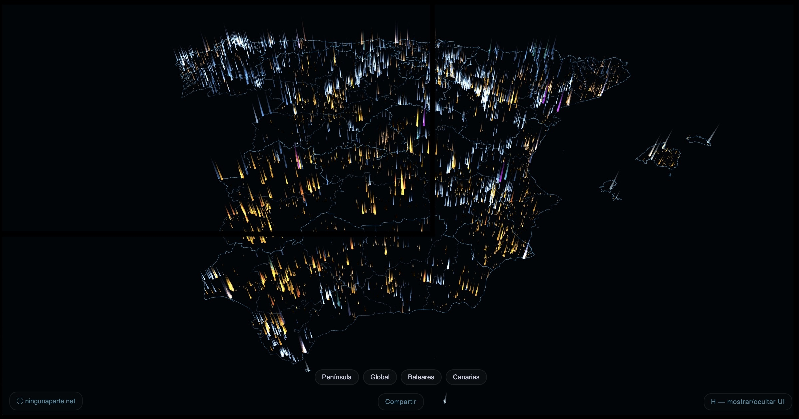

# Spain Power Plants & Grid Dataset

GeoJSON datasets of Spain's electricity generation installations and high-voltage transmission grid, normalized and geocoded from official public sources.

**→ Live visualization: [red.ningunaparte.net](https://red.ningunaparte.net)**  
**→ Author: [Victor San Vicente](https://ningunaparte.net)**

This dataset was built to power the [red.ningunaparte.net](https://red.ningunaparte.net) visualization. Getting clean, geocoded, technology-normalized data from Spain's official registries took considerable work — province name formats, missing coordinates, cross-referencing two separate registries — so it seemed worth sharing in case it saves someone else the same effort.

---

## Files

### `data/plants_commercial_2026-05-19.geojson`

5,797 commercial electricity generation plants in Spain (≥ 0.5 MW registered capacity).

| Technology | Plants | Installed capacity |
|---|---|---|
| Solar PV | 2,292 | 27,171 MW |
| Wind | 1,144 | 31,325 MW |
| Hydro (run-of-river) | 1,378 | 16,757 MW |
| Combined cycle gas (CCGT) | 29 | 24,562 MW |
| Cogeneration | 859 | 7,164 MW |
| Nuclear | 5 | 7,117 MW |
| Fuel / gas | 20 | 4,337 MW |
| Pumped hydro | 9 | 3,425 MW |
| Solar thermal (CSP) | 51 | 2,302 MW |
| Coal | 3 | 1,820 MW |
| Other | 7 | 345 MW |
| **Total** | **5,797** | **126,325 MW** |

**Not included:** self-consumption installations (autoconsumo) and plants below 0.5 MW.

#### Fields

| Field | Description |
|---|---|
| `name` | Plant name (from REE registry, administrative annotations cleaned) |
| `technology_normalized` | Normalized technology key (see values in table above) |
| `technology_ree` | Original technology string from REE |
| `installed_capacity_mw` | Registered installed capacity in MW |
| `municipality` | Municipality name |
| `province` | Province name |
| `autonomous_region` | Autonomous community (CCAA) |
| `minetur` | RAIPEE registry ID(s) |
| `owner` | Plant owner/operator (when available via ELECTRA cross-reference) |
| `installed_capacity_mw_electra` | Capacity from ELECTRA cross-reference (may differ from REE value) |
| `status` | Operational status from ELECTRA (`active`, `inactive`, `unknown`) |
| `source` | `REE` or `REE+ELECTRA` (47% of records cross-referenced) |
| `category` | Always `commercial` in this file |

---

### `data/powerlines_hv_2026-05-14.geojson`

4,929 high-voltage transmission line segments in Spain (220 kV and 400 kV).

| Voltage | Segments |
|---|---|
| 400 kV | 1,752 |
| 220 kV | 3,176 |

#### Fields

| Field | Description |
|---|---|
| `voltage` | Voltage in volts (`400000`, `220000`) |
| `line_type` | `overhead` or `underground` |
| `circuits` | Number of circuits |
| `name` | Line name (when available) |
| `operator` | Operator name |
| `osm_id` | OpenStreetMap way ID |

---

## Methodology

### Plants

Built by cross-referencing two official Spanish registries:

1. **REE ArcGIS FeatureServer** (`georedservices.ree.es`) — primary source for plant locations and grid connection identifiers. Contains over 23,000 raw records including duplicates, self-consumption installations, and incomplete entries.
2. **ELECTRA / RAIPEE (MITECO)** — official administrative registry with owner, operational status, and officially registered capacity. Cross-referenced by fuzzy name matching within the same province (47% match rate).

Additional processing applied:
- Province names normalized (inverted comma format "PALMAS, LAS" → "LAS PALMAS", encoding fixes for corrupted characters)
- 22 coordinates corrected via Nominatim geocoding (erroneous or missing values)
- Administrative annotations removed from plant names (e.g. `(CORREGIDA LA POTENCIA 23/1/2003)`)
- Filtered to commercial category ≥ 0.5 MW; records without valid coordinates or autonomous community assignment discarded

### Power lines

Extracted from OpenStreetMap via Overpass API, filtered to lines tagged `voltage=220000` or `voltage=400000` within Spain's bounding box, exported with a minimal normalized schema.

---

## Data sources & attribution

- [REE](https://www.ree.es/) — Red Eléctrica de España ArcGIS FeatureServer
- [ELECTRA / RAIPEE](https://energia.gob.es/electricidad/registroautonomicoinstalaciones/) — MITECO official registry (Ministerio para la Transición Ecológica)
- [© OpenStreetMap contributors](https://www.openstreetmap.org/copyright) — power lines data (ODbL license)
- [Nominatim](https://nominatim.openstreetmap.org/) — geocoding for missing/incorrect coordinates
- [Click That Hood](https://github.com/codeforgermany/click_that_hood) / CartoDB — administrative boundaries (CCAA and provinces), used in processing pipeline only

---

## Updates

Datasets are updated periodically as new data is extracted from the source registries. The date in each filename reflects the extraction date (`YYYY-MM-DD`).

---

*Dataset de instalaciones de generación eléctrica en España normalizado a partir de fuentes oficiales públicas (REE, RAIPEE/MITECO). Visualización interactiva en [red.ningunaparte.net](https://red.ningunaparte.net).*